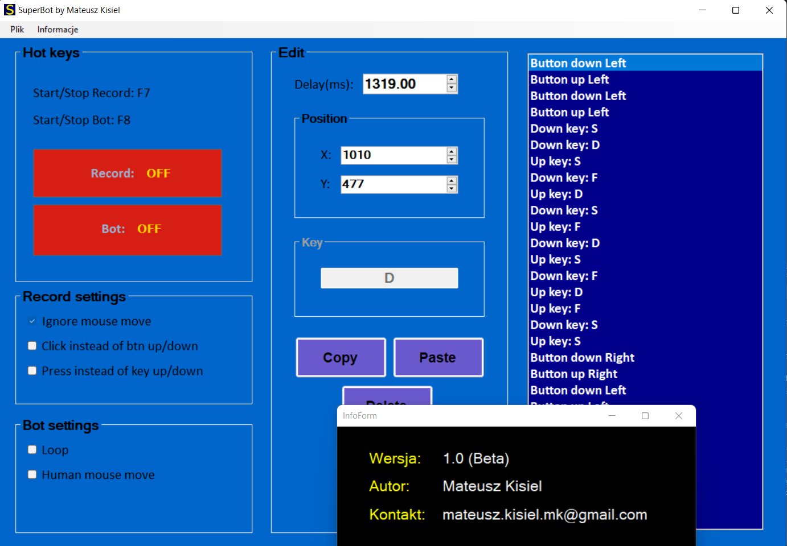

## SuperBot _by Mateusz Kisiel_
### Opis projektu:
Pogram służy do łatwego tworzenia botów i makr na Windowsa, przez osoby które nie umieją programować.  
Projekt jest napisany w C# z Windows Forms używając wzorca MVP.

### Screen programu:

### Instrukcja:
Gdy klikniemy klawisz F7 rozpocznie się nagrywanie. Wtedy każde kliknięcie/poruszenie myszką/klawiaturą zostanie zapisane. Aby zakończyć nagrywanie klikamy ponownie F7.
Nagrane makro można zapisać do pliku (rozszerzenie .sbot), a także wczytać z pliku. 
Zapisany plik możemy uruchomić (także z poziomu innego programu) - wtedy makro się wykona (bez otwierania interfejsu edytora).
Zapisane makro możemy także edytować. Przyciski są intuicyjne. Program zawiera także opcje nagrywania i odtwarzania: np. odtwarzenie makra w pętli lub nie nagrywanie ruchów myszki (same kliknięcia)

